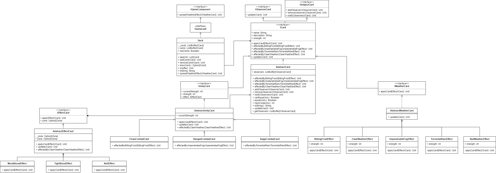
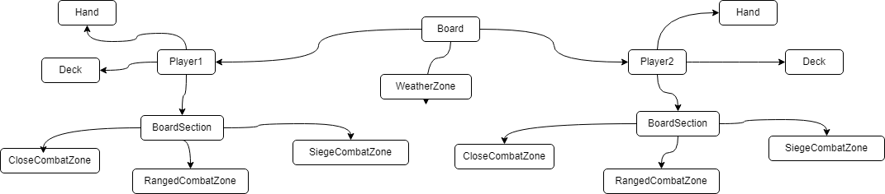
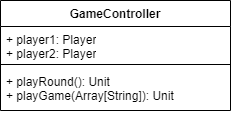

# Gwen't

This work is licensed under a
[Creative Commons Attribution 4.0 International License](http://creativecommons.org/licenses/by/4.0/)

Context
-------

This project's goal is to create a (simplified) clone of the
[_Gwent_](https://www.playgwent.com/en)card game developed by [_CD PROJEKT RED_](https://cdprojektred.com/en/)

---

# Cartas

Como componente principal del juego, se encuentran las cartas. Para abstraer una carta genérica, se utiliza la 
interfaz `ICard`, el cuál hereda de las interfaces `IObserverCard` y `ISubjectCard`, pues a la hora de implementar el 
patrón observer, se está diciendo que cualquier carta puede ser una observadora, o puede ser observada. 

Dentro de la clase `ICard`, se utiliza un double dispatch para que cualquier carta pueda ser afectada por una carta 
de clima (algo que se utilizará a la hora de implementar un composite en el tablero). La representación abstracta de 
una carta se obtiene a través de la clase `AbstractCard`, en donde se implementa todos los métodos genéricos de una 
carta, además de que a este nivel se implementa los métodos necesarios del observer. 

Luego se implementa una clase abstracta `AbstractUnityCard`, junto con una interfaz `IUnityCard` para representar a 
las cartas de unidad. De esta clase se derivan las clases `CloseCombatCard`, `RangedCombatCard` y `SiegeCombatCard`. 
Además, dado que las cartas de unidad tiene la posibilidad de aplicar un efecto, para evitar tener una explosión de 
clases se crean las clases `MoralBoostEffect`, `TightBondEffect` y `NullEffect`, conectadas por una clase abstracta 
`AbstractEffectCard` y que implementa la interfaz `IEffectCard`. La última de estas clases, `NullEffect`, es para 
dejar un efecto por defecto, haciendo uso del patrón Null-Object. Cabe destacar que la idea de que una carta 
de unidad **tenga** un efecto como una clase secundaria, es para aplicar el patrón Bridge.

Por otro lado, se implementa también la clase abstracta `AbstractWeatherCard`, el que implementa la interfaz 
`IWeatherCard`. Se separan las cartas de clima en donde cada clase es un efecto distinto. Esto se hizo, pues se 
consideró que utilizar el patrón bridge en este caso sería una sobre-ingeniería, pues no existen tantas 
combinaciones de carta con efecto (de hecho, en este caso hay un solo tipo de carta, el de clima, con cuatro efectos 
distintos). Se implementan entonces las clases `BittingFrostEffect`, `ClearWeatherEffect`, `ImpenetrableFogEffect`, 
`TorrentialRainEffect` y `NullWeatherEffect`, en donde en este último es para poder dejar un carta de clima por 
defecto a las secciones del tablero (de lo que se hablará más adelante).

Finalmente, se implementa una clase `Deck` que es un contenedor de cartas `ICard`.

# Tablero

Se empezará hablando del tablero `Board`. Para este, se optó por utilizar el patrón composite, pues tenemos la 
siguiente estructura de árbol:
* Los tableros tienen jugadores, además de una zona de clima compartida
* Los jugadores tienen una sección del tablero, un mazo y una mano de cartas
* La sección del tablero está compuesto de los tres tipos de zonas distintos, además de tener una zona de clima 
  compartida

De forma más gráfica, esto se puede ver así:

Y, por tanto, si es que un jugador desea jugar una zona de clima en el tablero, el efecto de esta carta lo tiene que
repartir en todas las cartas que se encuentra en el juego, entonces se tiene que "derramar" recursivamente en esta 
estructura de árbol que se deduce.

Por este motivo, con el fin de implementar el patrón composite, se implementaron las interfaces `IGameComponent`, 
`IGameComposite` y `IGameLeaf`. La primera de ellas, `IGameComponent`, tendrá el método  `spreadWeatherEffect(card: 
IWeatherCard)`, que se encargará de repartir la carta sobre todo el tablero. Mientras tanto, las otras dos clases no 
tendrán ningún método, y solo servirán de guía para indicar si la clase que la implementa es una del tipo hoja (como 
si fuera un nodo externo) o del tipo composite (como si fuera un nodo interno).

A partir de aquí se puede hablar más detalladamente de las clases que componen este módulo. Empezando con una de las 
hojas, se encuentran las zonas, abstraídas a través de la interfaz `IZone` y de la clase abstracta `AbstractZone`. 
De esta clase, se derivan las clases concretas `CloseCombatZone`, `RangedCombatZone`, `SiegeCombatZone` y 
`WeatherCombatZone`. La tarea de estas clases como hojas del composite será aplicar el efecto de la carta de clima 
sobre todas las cartas que hay en su zona respectiva, con excepción de la zona de clima, que solamente guardará esta 
carta en su espacio correspondiente, para indicar que ya ha sido jugada.

La clase `Player` será el protagonista del juego. Este posee una mano, un mazo, un nombre, su sección del tablero, 
las gemas, entre otras cosas. Este podrá jugar cartas en su zona respectiva, además de que su tarea como composite 
será el de repartir el efecto de la carta de clima en todas las cartas de su mano, en las cartas de su mazo y en su 
sección del tablero correspondiente.

Por otro lado, la sección del tablero se compone de las cuatro zonas: `CloseCombatZone`, `RangedCombatZone`, 
`SiegeCombatZone` y `WeatherCombatZone`. Por tanto, la tarea de cada una de estas zonas, como un composite, será el 
de propagar el efecto de la carta de clima sobre las zonas `CloseCombatZone`, `RangedCombatZone`,
y `SiegeCombatZone`. La parte de `WeatherCombatZone` se encargará el tablero.

Por último, la clase `Board` es una clase que se instancia con dos jugadores, y de forma interna instancia la (única) 
zona de clima, junto con las secciones del tablero que tendrán los jugadores. Esta clase se encargará de repartir la 
carta en los jugadores y la zona de clima. 

Por último, y no menos importante, se encuentra el controlador del juego, `GameController`, el cuál se encarga de 
utilizar todos los elementos anteriores e iniciar un juego, haciendo que los jugadores interactúen entre ellos y que 
realicen los movimientos necesarios.

